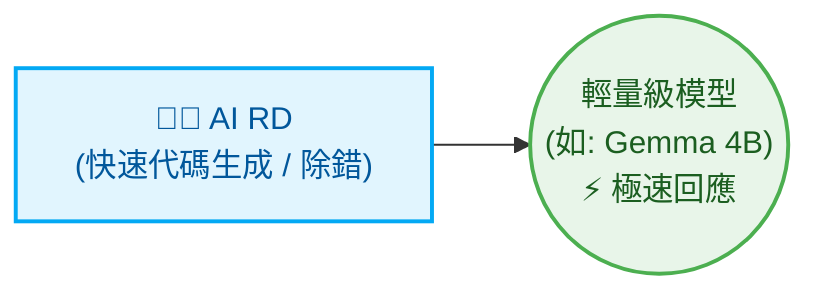
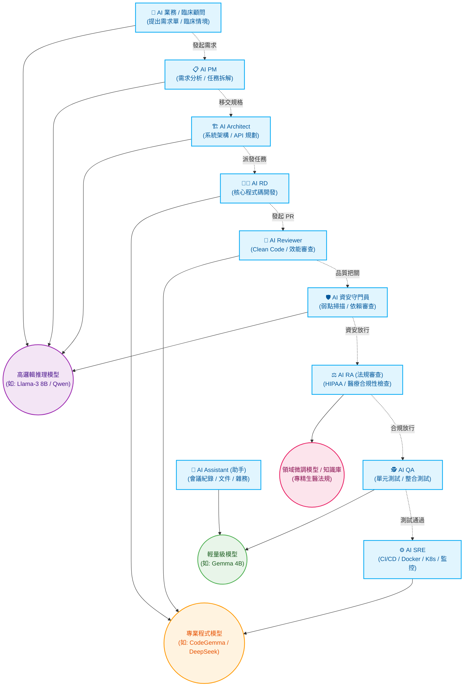

# Multi-Agent 流程協調器 (Orchestrator)

[繁體中文](README.md) | [English](README_en.md) | [日本語](README_ja.md) | [简体中文](README_zh-CN.md)

本專案是一個用 Python 撰寫的輕量級 Multi-Agent 流程協調器。它能夠協調整合本機 Ollama 模型（Manager 與 Reviewer）、Codex CLI（Developer）與 Claude Code，以固定狀態機（State Machine）的方式自動執行需求規劃、程式實作、單元測試和代碼審查的閉環開發流程。

---

## 系統架構

```text
               你輸入需求
                   ↓
         [ Python Orchestrator ]
                   ↓
         [ Manager (負責分析需求、拆解任務) ]
                   ↓
  ┌────────────────┬────────────────┐
  │   Developer    │    Reviewer    │
  │ (負責實作任務) │ (負責代碼審核) │
  └────────────────┴────────────────┘
                   ↓
         [ QA Agent 進行自動化驗證 ]
                   ↓
         [ Reviewer 進行代碼審核 ]
          ├── 通過 → 合併分支並產生 Final Report
          └── 退回 → 產生修復任務單 (FIX-TASK) 交回 Developer 單點修改
                   ↓
         [ Assistant (自動生成 CHANGELOG.md) ]
```

---

## 角色高度自訂化與動態擴縮 (Dynamic Role Allocation)

本系統的核心設計理念在於**「角色的高度自訂化與動態調整」**，能夠根據專案規模（Scale）彈性配置不同的 AI 角色與底層模型，讓運算資源與產出效率達到最佳化。

### 🚀 最小化配置 (適合：小型工具、單一腳本、快速迭代)

面對需求明確且範圍小的任務，可以僅配置單一角色，以極速產出為主：



* **AI RD (開發者)**：唯一上陣的角色，專注將指令轉換為可執行的程式碼。
* **分配模型**：使用輕量級模型 (如 Gemma 4B)，提供無延遲的極速生成體驗。

### 🏢 終極最大化配置 (適合：生醫產業、全生命週期 DevSecOps)

面對企業級與高度合規要求的軟體開發（如生醫產業），系統能動態擴充為一支涵蓋業務、法規、開發與資安的完整虛擬團隊：



* **跨域協作與合規把關 (生醫專屬亮點)**：由 AI 業務提出臨床需求，AI PM 轉化為工程規格；在程式碼合併前，不僅經過 AI 資安守門員把關，更加入 **AI RA (法規審查員)**，確保系統架構與資料處理符合生醫法規 (如 HIPAA / 個資法)。
* **主力實作與交付 (分配給專業程式模型)**：AI RD 負責實作，AI Reviewer 檢視品質，最後交由 AI SRE 撰寫 CI/CD 與部署腳本 (IaC)。
* **輔助與高頻任務 (分配給輕量極速模型)**：AI QA 負責快速產出大量測試案例，AI Assistant 隨時待命處理文件生成，極大化節省高參數量模型的運算資源。

---

## 檔案目錄結構

本工具執行後，會自動在當前目錄下建立 `.ai-company/` 資料夾，並包含以下檔案：

```text
.ai-company/
├── config.json             # 系統設定檔 (模型名稱, 測試指令, 代理人後端, 語系)
├── state.json              # 狀態記錄檔 (記錄當前執行狀態與任務清單)
├── request.md              # 你的原始自然語言需求
├── requirements.md         # Manager 產生的詳細功能需求說明書
├── implementation_plan.md  # Developer 產生的步驟化實作計畫
├── action_items.json       # 經 Manager 拆解後的結構化 JSON 任務清單
├── developer_output.md     # 實作過程中 Developer 的日誌與輸出
├── reviewer_output.md      # Reviewer 針對計畫與程式碼的審查意見
├── test_results.txt        # 測試指令執行的輸出結果
└── final_report.md         # 專案完成後的總結報告

# 專案根目錄
└── CHANGELOG.md            # Assistant 自動即時更新的變更日誌
```

---

## 如何避免 WSL 記憶體不足與卡死（非常重要 ⚠️）

您的 WSL 虛擬機器目前配置的實體記憶體為 **7.7 GB**。因為 `gemma4:latest` 的大小約為 **9.6 GB**，如果直接在 WSL 內部跑 Ollama 載入此模型，會導致 WSL 的記憶體嚴重不足、瘋狂進行交換（Swapping）並使系統完全卡死。

### 建議的解決方案：使用 Windows Host 的 Ollama
1. **在 Windows 主機下載並啟動 Ollama**（Windows 主機可以使用 GPU 顯存和更大的系統記憶體）。
2. 在 WSL 中，使用 `ip route show | grep default` 查詢 Windows 主機的 IP（在初始化時，協調器會自動幫你計算出建議的 Windows Host IP，例如 `172.17.144.1`）。
3. 修改 `.ai-company/config.json`，將 `ollama_url` 指向 Windows 的 IP：
   ```json
   {
     "ollama_url": "http://172.17.144.1:11434",
     "ollama_model": "gemma4:latest",
     ...
   }
   ```
4. 這樣一來，WSL 內的 Python Orchestrator 就會透過內部網路向 Windows 的 Ollama 發送請求，既能享用本機運算又不會佔用 WSL 寶貴的 7.7GB 記憶體！

---

## 快速上手指令

### 1. 初始化環境
在當前 Git 專案目錄下執行：
```bash
python3 orchestrator.py init
```
這會建立 `.ai-company/` 資料夾並產生預設設定檔。

### 2. 啟動新任務
輸入你的自然語言需求，啟動開發流程：
```bash
python3 orchestrator.py start "加入聯絡人搜尋功能，並在 search.py 寫好對應測試"
```
這會將狀態重設為 `PLANNING`，並將需求寫入 `.ai-company/request.md`。

### 3. 單步執行（推薦用於除錯或逐部審查）
每次執行下一個狀態轉移：
```bash
python3 orchestrator.py step
```
這會執行當前狀態（例如 `PLANNING` -> `DEVELOPING_PLAN`），並在完成後暫停，方便你查看中間產生的文件（例如 `requirements.md`）。

### 4. 全自動執行到結束
自動在背景跑完所有流程（遇到 Review 退回會自動進行最多 2 輪修改，直到完成或需要人工介入）：
```bash
python3 orchestrator.py run
```

### 5. 檢視當前狀態
顯示目前狀態、設定值、修改輪數以及各項任務的完成進度：
```bash
python3 orchestrator.py status
```

### 6. 重設狀態
若想重新執行某一階段（例如重新產生實作計畫）：
```bash
python3 orchestrator.py reset --state DEVELOPING_PLAN
```

### 7. 更換代理人（Agent）後端
您可以隨時更換個別角色的執行後端（支援 `ollama`、`codex`、`claude`、`agy`）：
* **將實作者改為 Codex CLI (預設值)**:
  ```bash
  python3 orchestrator.py set-backend developer codex
  ```
* **將審查者 (Reviewer) 改為 agy (使用您已透過 OAuth2 登入的 Gemini)**:
  ```bash
  python3 orchestrator.py set-backend reviewer agy
  ```
* **將 QA 測試員改為 Ollama**:
  ```bash
  python3 orchestrator.py set-backend qa ollama
  ```
* **將 Assistant 改為 Ollama**:
  ```bash
  python3 orchestrator.py set-backend assistant ollama
  ```

---

## Ponytail 極簡開發原則 (Minimalist Coding)

本專案支援 **Ponytail** 核心思維。當您在 [.ai-company/config.json](file:///home/oss-gp/multi-agents/.ai-company/config.json) 中啟用：
```json
"use_ponytail": true
```

協調器會在與 **Developer**（實作者）和 **Reviewer**（審查者）對話時，自動在 System Prompts 中注入 `ponytail` 規則。這會強力規範 AI 代理人遵守：
* **YAGNI (You Aren't Gonna Need It)**：只做當前需要的功能，不進行任何超前部署與猜測性的架構設計。
* **極簡代碼梯子 (The Ladder)**：優先使用系統原生功能與標準庫（stdlib），避免引入非必要依賴，縮減程式碼行數與變更（Shortest Diff Wins）。
* **杜絕冗餘封裝**：不使用單一實作的介面、不做預留的工廠模式，保持代碼最簡化。

---

## 核心亮點功能

### 1. Git Worktree 隔離開發 (Zero-Risk)
預設開啟 `"use_worktree": true`。
協調器會在背景自動建立一個獨立的 Git 分支與 Worktree (`.ai-company/worktree`) 進行開發與測試。這代表您的主分支 (`master`) 完全不會被未經 Review 的程式碼污染。只有在 QA 與 Reviewer 雙雙核准 (`APPROVED`) 後，系統才會安全地自動將修改合併回主分支。

### 2. 單點精準修復任務 (Targeted Fixes)
當 QA 驗證失敗或 Reviewer 退件時，系統不會愚蠢地強迫 Developer 重新撰寫所有程式碼。而是會將錯誤報告包裝成單一修復任務單 (`FIX-QA-1` 或 `FIX-REV-1`)，交回給 Developer 進行精準修改，大幅節省時間與運算資源。

### 3. 多國語系支援 (Multilingual Interface)
在 `.ai-company/config.json` 中設定：
```json
"language": "zh-TW"
```
支援 `en` (英文)、`zh-TW` (繁體中文)、`ja` (日文)。所有終端機日誌、提示詞 (Prompt) 以及輸出的報告與 Changelog 都會依照您的語系偏好自動切換。

### 4. Assistant 自動生成 CHANGELOG
預設開啟 `"assistant": "ollama"` (指向 `gemma2:2b` 等輕量模型)。
當專案開發順利完成合併後，Assistant 代理人會自動分析 Manager 的總結報告與 Git Diff，並「即時」為您寫下一筆專業的 Markdown 格式 `CHANGELOG.md` 變更紀錄。

---

## 與主流大廠開源框架 (AutoGen / CrewAI / OpenDevin) 的差異與優勢

如果您熟悉微軟的 AutoGen 或開源的 OpenDevin，您可能會好奇本系統的獨特價值。主流框架通常是強大的「通用型工具」，但在企業級軟體開發落地時常遇到痛點。本系統針對**軟體開發生命週期 (SDLC)** 量身打造，具備以下決定性優勢：

### 1. 拒絕發散聊天，採用「確定性狀態機 (State Machine)」
* **大廠框架的痛點**：基於「對話驅動 (Chat-driven)」，Agent 之間自由對話決定下一步。在軟體開發中容易陷入無限迴圈、偏離主題，導致 API 成本暴增且不可控。
* **本系統優勢**：採用嚴謹的固定狀態機 (`需求 -> 計畫 -> 開發 -> QA -> 審查 -> 合併`)。保證了每次執行的穩定性、可預測性與極高的成功率，符合企業級流程需求。

### 2. 內建 Git Worktree 安全隔離 (Zero-Risk)
* **大廠框架的痛點**：AI 通常直接在當前專案目錄修改檔案，一旦 AI 發生幻覺暴走，極易改壞現有程式碼。
* **本系統優勢**：原生內建 Git 隔離機制。所有 AI 操作都在 `.ai-company/worktree` 分支中進行，主分支 (`master`) 絕對安全。只有在 AI QA 與 Reviewer 皆核准 (`APPROVED`) 後才會合併，提供企業無可取代的保護傘。

### 3. 精準修復任務單 (Targeted Fixes)，節省算力
* **大廠框架的痛點**：測試失敗時，通用 Agent 常會重寫整個檔案，不僅浪費算力，還容易引入新 Bug。
* **本系統優勢**：當 QA 驗證失敗時，系統會將錯誤包裝成單一修復任務單 (`FIX-QA-1`) 交回給 Developer。AI 僅針對錯誤點進行小幅度精準修改，大幅提高除錯效率。

### 4. 內建軟體工程思維 (Ponytail 極簡原則)
* **大廠框架的痛點**：容易過度設計 (Over-engineering)，寫出難以維護的複雜架構。
* **本系統優勢**：強制注入 YAGNI 原則，禁止猜測性架構設計，追求變更最小化 (Shortest Diff Wins)。產出的程式碼乾淨、易維護且符合人類審查習慣。

---

## 整合使用 agy CLI (Gemini OAuth 2.0)

本專案原生支援直接呼叫您在系統中已登入的 `agy` (Antigravity CLI)，**嚴格禁止使用明文 API Key**，全面落實 OAuth 2.0 安全規範。

1. **認證說明**：
   只要您已經登入您的 Google 帳戶，協調器在執行時就會自動調用 `agy --print` 命令取得模型回應。完全不需要填寫或暴露任何 API 金鑰，保證極致安全。

2. **切換角色後端為 Gemini (agy)**：
   ```bash
   python3 orchestrator.py set-backend developer agy
   ```

---

## 後端代理人容錯機制 (Graceful Fallback)

為了確保在某個後端 API 或 CLI 無法運作時流程不中斷：
* 如果 `claude`、`codex` 或 `gemini` 尚未登入或設定 API Key 報錯，系統會自動降級（Fallback）使用本機的 **Ollama (gemma4)** 進行對應動作。
* 當您日後配置完成後，協調器會自動恢復使用您指定的進階 API/CLI。

