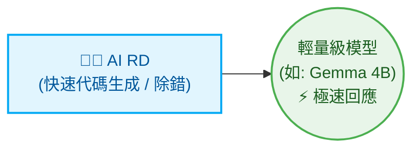

# Multi-Agent 流程協調器 (Orchestrator)

[繁體中文](README.md) | [English](README_en.md) | [日本語](README_ja.md) | [简体中文](README_zh-CN.md)

本專案是一個用 Python 撰寫的輕量級 Multi-Agent 流程協調器。它使用確定性狀態機（State Machine）進行需求規劃、架構審查、程式實作、驗證、代碼審查和發佈說明。每個任務都會根據其複雜度和領域風險路由到相應角色和模型層級。

---

## 系統架構

```text
               你輸入需求 (User Input)
                    ↓
          [ Python Orchestrator ]
                    ↓
          [ PM (負責分析需求、拆解任務) ]
                    ↓
          [ Architect (負責計畫與架構審查) ]
                    ↓
       [ RD 團隊 (Senior / Middle / Junior) ]
                    ↓
          [ QA 團隊 (Senior / Middle / Junior) ]
                    ↓
          [ Reviewer (負責代碼審核) ]
           ├── APPROVED → 合併分支並產生 Final Report
           └── REJECTED → 產生修復任務單 (FIX-TASK) 交回 Developer 單點修改
                    ↓
          [ Assistant (自動生成 CHANGELOG.md) ]
```

---

## 角色高度自訂化與動態分配 (Highly Customizable & Dynamic Role Allocation)

此協調器一律啟用 PM、Architect、RD、Reviewer、QA 和 Assistant。PM 只有在專案需要時才會選擇領域專家（Specialists），然後他們的分析結果會在計畫批准前提供給 Architect。

| 角色 | 使用時機 | 預設模型路由 |
| --- | --- | --- |
| PM | 每個專案：需求與任務分配 | Codex `gpt-5.6-sol` |
| Architect | 每個專案：計畫與架構審查 | AGY Gemini `gemini-3.1-pro` |
| RD / QA senior | 架構、資安、遷移或模糊的工作 | Codex `gpt-5.6-terra` |
| RD / QA middle | 標準功能與整合工作 | Codex `gpt-5.6-luna` |
| RD / QA junior | 孤立、重複的常規工作 | AGY Gemini `gemini-3.5-flash` |
| Reviewer | 每個專案：代碼與測試結果審查 | Codex `gpt-5.6-sol` |
| Assistant | 每個專案：CHANGELOG 與常規文件 | Local Ollama `gemma4:latest` |

### 動態專家 (Dynamic Specialists)

PM 僅在適用其觸發條件時啟用以下專家：

| 專家 | 觸發條件 | 預設模型路由 |
| --- | --- | --- |
| Sales (業務) | 業務範圍或驗收標準不明確 | Local Ollama `qwen2.5:latest` |
| Security (資安) | 涉及身分驗證、金鑰、支付、PII（個人識別資訊）或攻擊面 | Local Ollama `deepseek-r1:latest` |
| RA (法規) | 適用法律、法規、醫療保健、財務合規或隱私義務 | AGY Gemini `gemini-3.1-pro` |
| SRE | CI/CD、容器、部署、監控或運維可靠性在範圍內 | AGY Gemini `gemini-3.1-pro` |

RA 提供的是模型審查，而非經證實的法律研究。生產環境的合規工作應增加權威來源的檢索與引用。

### 🚀 最小化配置 (適合：小型工具、單一腳本、快速迭代)

面對明確且範圍小的任務，可以僅配置單一角色，以極速產出為主：



### 🏢 終極最大化配置 (適合：企業級、全生命週期 DevSecOps)

對於企業級和高度合規要求的軟體開發，系統能擴充為一支完整的虛擬團隊：

* **跨領域協作與合規把關**：AI Business 提出需求，AI PM 轉化為工程規格。在合併前，由 AI Security Guard（資安守門員）和 AI RA (Regulatory Affairs，法規審查員) 檢查合規性。
* **核心實作與交付**：AI RD 負責實作，AI Reviewer 檢視品質，最後交由 AI SRE 撰寫 CI/CD 與部署腳本。
* **輔助與高頻任務**：AI QA 負責撰寫測試案例，AI Assistant 使用輕量模型處理文件生成，以節省運算資源。

---

## 檔案目錄結構

本工具執行後，會自動在當前目錄下建立 `.ai-company/` 資料夾，並包含以下檔案：

```text
.ai-company/
├── config.json             # 系統設定檔
├── state.json              # 狀態記錄與任務清單
├── request.md              # 您的原始需求
├── requirements.md         # Manager 產生的詳細功能需求說明書
├── implementation_plan.md  # Developer 產生的步驟化實作計畫
├── action_items.json       # 結構化 JSON 任務清單
├── developer_output.md     # Developer 的日誌與輸出
├── reviewer_output.md      # Reviewer 的審查意見
├── test_results.txt        # 測試指令執行的輸出結果
└── final_report.md         # 專案完成後的總結報告

# 專案根目錄
└── CHANGELOG.md            # Assistant 自動即時更新的變更日誌
```

---

## 快速上手指令

### 1. 初始化環境
```bash
python3 orchestrator.py init
```

### 2. 啟動新任務
```bash
python3 orchestrator.py start "Add contact search feature and write tests in search.py"
```

### 3. 單步執行 (推薦用於除錯)
```bash
python3 orchestrator.py step
```

### 4. 全自動執行到結束
```bash
python3 orchestrator.py run
```

### 5. 檢視當前狀態
```bash
python3 orchestrator.py status
```

### 6. 重設狀態
```bash
python3 orchestrator.py reset --state DEVELOPING_PLAN
```

### 7. 更換代理人 (Agent) 後端
```bash
python3 orchestrator.py set-backend developer codex
python3 orchestrator.py set-backend reviewer agy
```

---

## Ponytail 極簡開發原則 (極簡代碼)

在 `.ai-company/config.json` 中啟用 ponytail 模式：
```json
"use_ponytail": true
```
這會強制執行 YAGNI (You Aren't Gonna Need It)，並推動 AI 在不進行過度設計的情況下使用盡可能短的程式碼變更（Shortest Diff Wins）。

---

## 核心亮點功能

1. **Git Worktree 隔離開發 (零風險)**：所有 AI 操作都在獨立的分支與工作區中進行 (`.ai-company/worktree`)。
2. **單點精準修復**：當 QA 驗證失敗時，僅針對具體失敗的邏輯進行修復。
3. **多國語系支援**：支援 `en`、`zh-TW`、`ja` 和 `zh-CN`。可在 `config.json` 中修改 `"language"` 設定。
4. **自動生成 CHANGELOG**：Assistant 代理人在專案完成後會自動生成 `CHANGELOG.md`。
