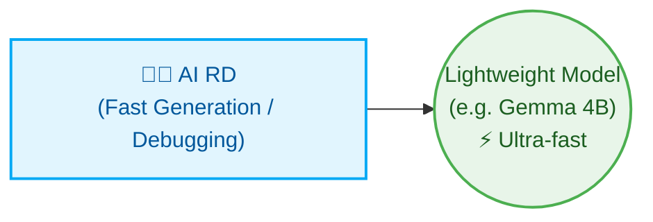

# Multi-Agent Orchestrator

[繁體中文](README.md) | [English](README_en.md) | [日本語](README_ja.md) | [简体中文](README_zh-CN.md)

This project is a lightweight Multi-Agent Orchestrator written in Python. It uses a deterministic state machine for requirements planning, architecture review, implementation, verification, code review, and release notes. Each task is routed to a role and model tier based on its complexity and domain risk.

---

## System Architecture

```text
               User Input
                   ↓
         [ Python Orchestrator ]
                   ↓
         [ PM (Requirements and task allocation) ]
                   ↓
       [ Specialists (RA / Sales → Grok CLI) ]
                   ↓
         [ Architect (Plan review) ]
                   ↓
      [ RD Team (Senior / Middle / Junior) ]
                   ↓
         [ QA Team (Senior / Middle / Junior) ]
                   ↓
         [ Reviewer (Code review) ]
          ├── APPROVED → Merge branch and generate Final Report
          └── REJECTED → Generate fix tasks (FIX-TASK) back to Developer for targeted fixes
                   ↓
         [ Assistant (Auto-generates CHANGELOG.md) ]
```

---

## Highly Customizable & Dynamic Role Allocation

The orchestrator always enables PM, Architect, RD, Reviewer, QA, and Assistant. The PM also selects domain specialists only when the project warrants them, then their findings are supplied to the Architect before plan approval.

| Role | When used | Default model route |
| --- | --- | --- |
| PM | Every project: requirements and task allocation | Codex `gpt-5.6-sol` |
| Architect | Every project: plan and architecture approval | AGY Gemini `gemini-3.1-pro` |
| RD / QA senior | Architecture, security, migrations, or ambiguous work | Codex `gpt-5.6-terra` |
| RD / QA middle | Standard feature and integration work | Codex `gpt-5.6-luna` |
| RD / QA junior | Isolated, repetitive routine work | AGY Gemini `gemini-3.5-flash` |
| Reviewer | Every project: code and test-result review | Codex `gpt-5.6-sol` |
| Assistant | Every project: CHANGELOG and routine documentation | Local Ollama `gemma4:latest` |
| Grok | Domain analysis when RA or Sales specialists are needed | Grok CLI `grok-4.5` |

### Dynamic Specialists

The PM may activate the following specialists only when their trigger applies:

| Specialist | Trigger | Default model route |
| --- | --- | --- |
| Sales | Business scope or acceptance criteria are unclear | Grok CLI `grok-4.5` |
| Security | Authentication, secrets, payments, PII, or an attack surface is involved | Local Ollama `deepseek-r1:latest` |
| RA | Laws, regulations, healthcare, financial compliance, or privacy obligations apply | Grok CLI `grok-4.5` |
| SRE | CI/CD, containers, deployment, monitoring, or operational reliability is in scope | AGY Gemini `gemini-3.1-pro` |

RA provides a model review, not verified legal research. Production compliance work should add authoritative-source search and citations.

### This README Acceptance & System Roles

Sales is a system specialist dynamically activated by the PM as needed; the fact that Sales is not involved in the acceptance process of this README modification does not mean that Sales is removed or deactivated. QA is responsible for verifying the Markdown structure, the commands and paths listed in the README, and the safely executable check results; after QA passes, the Reviewer reviews the document correctness, modification scope, and first-time user workflow based on requirements, implementation, and QA results, and decides whether to approve or reject for fixes.

### Grok agent

Grok is an external CLI agent selected by the orchestrator for domain analysis by the RA (regulatory) and Sales specialists. It is not an additional workflow stage and does not replace PM, Architect, RD, QA, or Reviewer. The PM uses Grok only when a specialist trigger applies, then the result is supplied to the Architect for plan review.

Before use, install the `grok` CLI and make it executable in the runtime environment. Grok is already the default backend for RA and Sales in a newly initialized project:

```bash
python3 orchestrator.py init
```

The orchestrator invokes the configured role through this interface:

```bash
grok -p "<prompt>" -m grok-4.5
```

Grok currently supports only `grok-4.5`, which is also the default model for RA and Sales; there is no second Grok model for fallback. When using the `grok` CLI directly, pass a model with `-m`; the orchestrator selects the RA or Sales model from `.ai-company/config.json`, in order: `role_model_tiers.ra[0]` or `role_model_tiers.sales[0]`, `role_models.ra` or `role_models.sales`, then `grok-4.5`. `set-backend` supports the `ra` and `sales` roles, but does not accept `grok` as a backend argument. If the Grok CLI or request fails, the role falls back in order to AGY with `gpt-oss-120b`, then Ollama with its configured model. If those backends also fail, the error is propagated. Grok's RA output is a model review, not verified legal research.

### 🚀 Minimalist Configuration (For: small tools, single scripts, fast iteration)

For small, clear tasks, you can deploy a single role for maximum speed:



### 🏢 Ultimate Max Configuration (For: enterprise, full-lifecycle DevSecOps)

For enterprise-level and highly compliant software development, the system can scale into a complete virtual team:

* **Cross-domain Collaboration & Compliance**: AI Business proposes requirements, AI PM converts them into specs. Before merging, an AI Security Guard and an AI RA (Regulatory Affairs) check compliance.
* **Core Implementation & Delivery**: AI RD implements, AI Reviewer checks quality, and AI SRE writes CI/CD and deployment scripts.
* **Auxiliary & High-frequency Tasks**: AI QA writes test cases, AI Assistant handles documentation using lightweight models to save resources.

---

## Directory Structure

After execution, the tool creates an `.ai-company/` folder containing:

```text
.ai-company/
├── config.json             # System config
├── state.json              # State tracker and task list
├── request.md              # Your original request
├── requirements.md         # Manager's detailed requirements
├── implementation_plan.md  # Developer's step-by-step plan
├── action_items.json       # Task list in JSON
├── developer_output.md     # Developer's logs
├── reviewer_output.md      # Reviewer's feedback
├── test_results.txt        # Output of test commands
├── qa_report.md            # QA verification report
├── human_report.md         # Report while waiting for owner review
├── specialist_reviews.md   # Dynamic-specialist consultation results
└── final_report.md         # Final summary report

# Project Root
└── CHANGELOG.md            # Auto-updated by Assistant
```

---

## Quick Start Commands

The following main examples use the wrapper entry point `python3 orchestrator.py` in the project root. The module entry point `python3 -m orchestrator.main <command>` is equivalent and can be used as an alternative if python module execution is preferred; please choose one and stick with it throughout the workflow.

### 1. Initialize Environment
```bash
python3 orchestrator.py init
```

### 2. Start a New Task
```bash
python3 orchestrator.py start "Add contact search feature and write tests in search.py"
```

### 3. Step Execution (Recommended for debugging)
```bash
python3 orchestrator.py step
```

### 4. Fully Automated Run
```bash
python3 orchestrator.py run
```

### 5. Check Status
```bash
python3 orchestrator.py status
```

### 6. Reset State
```bash
python3 orchestrator.py reset --state DEVELOPING_PLAN
```

### 7. Change Agent Backends
```bash
python3 orchestrator.py set-backend developer codex
python3 orchestrator.py set-backend reviewer agy
```

### 8. Approve a Paused Workflow
```bash
python3 orchestrator.py approve --run
```

`approve` applies only when the current state is `WAITING_FOR_OWNER`; without `--run`, it resumes the state without continuing execution.

### 9. Basic Verification
```bash
python3 -m pytest -q
```

`run`, `step`, and `approve --run` may call external AI CLIs, modify Git worktrees, or incur charges; without external services configured, safely verify first with `--help`, `verify_alignment.py`, and the test command above.

---

## Ponytail Minimalist Principle (Minimalist Coding)

Enable ponytail mode in `.ai-company/config.json`:
```json
"use_ponytail": true
```
This enforces YAGNI (You Aren't Gonna Need It) and pushes the AI to use the shortest possible diffs without over-engineering.

---

## Core Features

1. **Git Worktree Isolation (Zero-Risk)**: All AI operations happen in a separate branch (`.ai-company/worktree`).
2. **Targeted Fixes**: When QA fails, only the specific failed logic is targeted for repair.
3. **Multilingual Interface**: Supports `en`, `zh-TW`, `ja`, and `zh-CN`. Change `"language"` in `config.json`.
4. **Auto CHANGELOG**: Assistant automatically generates `CHANGELOG.md` upon completion.
