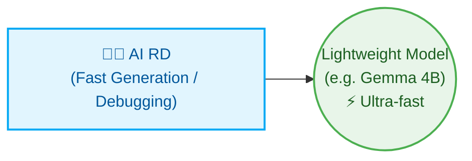

# Multi-Agent Orchestrator

[繁體中文](README.md) | [English](README_en.md) | [日本語](README_ja.md) | [简体中文](README_zh-CN.md)

This project is a lightweight Multi-Agent Orchestrator written in Python. It coordinates local Ollama models (Manager and Reviewer), Codex CLI (Developer), and Claude Code to automatically execute a closed-loop development process—including requirements planning, code implementation, unit testing, and code review—using a deterministic State Machine.

---

## System Architecture

```text
               User Input
                   ↓
         [ Python Orchestrator ]
                   ↓
         [ Manager (Analyzes requirements, breaks down tasks) ]
                   ↓
  ┌────────────────┬────────────────┐
  │   Developer    │    Reviewer    │
  │ (Implements)   │ (Reviews Code) │
  └────────────────┴────────────────┘
                   ↓
         [ QA Agent (Automated Verification) ]
                   ↓
         [ Reviewer (Code Review) ]
          ├── APPROVED → Merge branch and generate Final Report
          └── REJECTED → Generate fix tasks (FIX-TASK) back to Developer for targeted fixes
                   ↓
         [ Assistant (Auto-generates CHANGELOG.md) ]
```

---

## Highly Customizable & Dynamic Role Allocation

The core design philosophy of this system is **"highly customizable and dynamic role allocation"**, allowing it to dynamically configure different AI roles and underlying models based on the project scale to optimize compute resources and output efficiency.

### 🚀 Minimalist Configuration (For: small tools, single scripts, fast iteration)

For small, clear tasks, you can deploy a single role for maximum speed:



### 🏢 Ultimate Max Configuration (For: enterprise, full-lifecycle DevSecOps)

For enterprise-level and highly compliant software development, the system can scale into a complete virtual team:

* **Cross-domain Collaboration & Compliance**: AI Business proposes requirements, AI PM converts them into specs. Before merging, an AI Security Guard and an AI RA (Regulatory Affairs) check compliance.
* **Core Implementation & Delivery**: AI RD implements, AI Reviewer checks quality, and AI SRE writes CI/CD and deployment scripts.
* **Auxiliary & High-frequency Tasks**: AI QA writes test cases, AI Assistant handles documentation using lightweight models to save resources.

---

## Directory Structure

After execution, the tool creates an `.ai-company/` folder containing:

```text
.ai-company/
├── config.json             # System config
├── state.json              # State tracker and task list
├── request.md              # Your original request
├── requirements.md         # Manager's detailed requirements
├── implementation_plan.md  # Developer's step-by-step plan
├── action_items.json       # Task list in JSON
├── developer_output.md     # Developer's logs
├── reviewer_output.md      # Reviewer's feedback
├── test_results.txt        # Output of test commands
└── final_report.md         # Final summary report

# Project Root
└── CHANGELOG.md            # Auto-updated by Assistant
```

---

## Quick Start Commands

### 1. Initialize Environment
```bash
python3 orchestrator.py init
```

### 2. Start a New Task
```bash
python3 orchestrator.py start "Add contact search feature and write tests in search.py"
```

### 3. Step Execution (Recommended for debugging)
```bash
python3 orchestrator.py step
```

### 4. Fully Automated Run
```bash
python3 orchestrator.py run
```

### 5. Check Status
```bash
python3 orchestrator.py status
```

### 6. Reset State
```bash
python3 orchestrator.py reset --state DEVELOPING_PLAN
```

### 7. Change Agent Backends
```bash
python3 orchestrator.py set-backend developer codex
python3 orchestrator.py set-backend reviewer agy
```

---

## Ponytail Minimalist Principle (Minimalist Coding)

Enable ponytail mode in `.ai-company/config.json`:
```json
"use_ponytail": true
```
This enforces YAGNI (You Aren't Gonna Need It) and pushes the AI to use the shortest possible diffs without over-engineering.

---

## Core Features

1. **Git Worktree Isolation (Zero-Risk)**: All AI operations happen in a separate branch (`.ai-company/worktree`).
2. **Targeted Fixes**: When QA fails, only the specific failed logic is targeted for repair.
3. **Multilingual Interface**: Supports `en`, `zh-TW`, `ja`, and `zh-CN`. Change `"language"` in `config.json`.
4. **Auto CHANGELOG**: Assistant automatically generates `CHANGELOG.md` upon completion.
