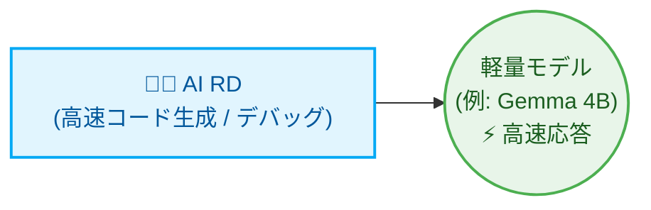
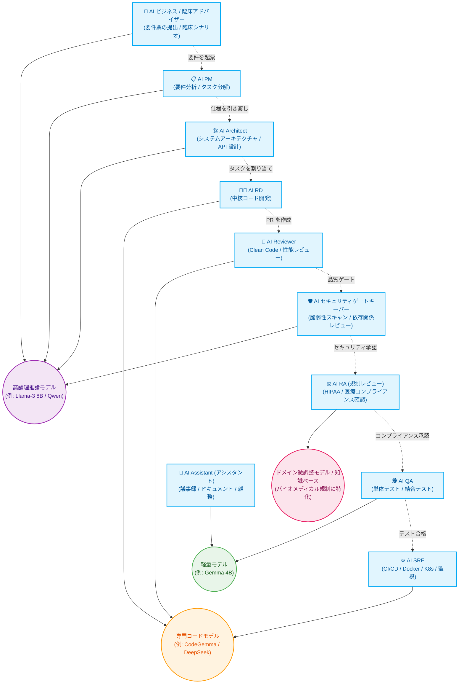

# Multi-Agent フローオーケストレーター (Orchestrator)

[繁体中文](README.md) | [English](README_en.md) | [日本語](README_ja.md) | [簡体中文](README_zh-CN.md)

本プロジェクトは、Python で書かれた軽量な Multi-Agent フローオーケストレーターです。ローカルの Ollama モデル（Manager と Reviewer）、Codex CLI（Developer）、Claude Code を連携させ、固定された状態機械（State Machine）により、要件計画、実装、単体テスト、コードレビューの閉ループ開発フローを自動実行します。

---

## システムアーキテクチャ

```text
               あなたが要件を入力
                   ↓
         [ Python Orchestrator ]
                   ↓
         [ Manager (要件分析・タスク分解を担当) ]
                   ↓
  ┌────────────────┬────────────────┐
  │   Developer    │    Reviewer    │
  │ (実装タスクを担当) │ (コードレビューを担当) │
  └────────────────┴────────────────┘
                   ↓
         [ QA Agent が自動検証を実行 ]
                   ↓
         [ Reviewer がコードレビューを実行 ]
          ├── 承認 → ブランチをマージして Final Report を生成
          └── 差し戻し → 修正タスク票 (FIX-TASK) を生成し Developer に返してピンポイント修正
                   ↓
         [ Assistant (CHANGELOG.md を自動生成) ]
```

---

## 役割の高度なカスタマイズと動的拡張 (Dynamic Role Allocation)

本システムの中核設計思想は、**「役割の高度なカスタマイズと動的調整」**です。プロジェクト規模（Scale）に応じて、異なる AI の役割と基盤モデルを柔軟に配置し、計算資源と出力効率を最適化できます。

### 🚀 最小構成 (対象: 小規模ツール、単一スクリプト、高速イテレーション)

要件が明確で範囲の小さいタスクでは、単一の役割だけを配置し、最速の成果物生成を優先できます。



* **AI RD (開発者)**：唯一稼働する役割で、指示を実行可能なコードへ変換することに集中します。
* **割り当てモデル**：軽量モデル (例: Gemma 4B) を使用し、遅延の少ない高速生成体験を提供します。

### 🏢 究極の最大構成 (対象: バイオメディカル産業、全ライフサイクル DevSecOps)

エンタープライズ級かつ高いコンプライアンスが求められるソフトウェア開発（例: バイオメディカル産業）では、業務、規制、開発、セキュリティを含む完全な仮想チームへ動的に拡張できます。



* **分野横断の協業とコンプライアンス確認 (バイオメディカル向けの強み)**：AI ビジネスが臨床要件を提示し、AI PM がエンジニアリング仕様へ変換します。コードマージ前には AI セキュリティゲートキーパーだけでなく **AI RA (規制レビュー担当)** も加わり、システム設計とデータ処理がバイオメディカル規制 (例: HIPAA / 個人情報保護法) に準拠していることを確認します。
* **主力実装とデリバリー (専門コードモデルに割り当て)**：AI RD が実装を担当し、AI Reviewer が品質を確認し、最後に AI SRE が CI/CD とデプロイスクリプト (IaC) を作成します。
* **補助と高頻度タスク (軽量高速モデルに割り当て)**：AI QA が大量のテストケースを高速に生成し、AI Assistant がいつでもドキュメント生成に対応することで、高パラメータモデルの計算資源を大きく節約します。

---

## ファイルディレクトリ構成

このツールを実行すると、現在のディレクトリに `.ai-company/` フォルダーが自動作成され、次のファイルが含まれます。

```text
.ai-company/
├── config.json             # システム設定ファイル (モデル名, テストコマンド, エージェントバックエンド, 言語)
├── state.json              # 状態記録ファイル (現在の実行状態とタスクリストを記録)
├── request.md              # 元の自然言語要件
├── requirements.md         # Manager が生成する詳細な機能要件仕様書
├── implementation_plan.md  # Developer が生成する段階的な実装計画
├── action_items.json       # Manager によって分解された構造化 JSON タスクリスト
├── developer_output.md     # 実装中の Developer のログと出力
├── reviewer_output.md      # Reviewer による計画とコードへのレビューコメント
├── test_results.txt        # テストコマンド実行の出力結果
└── final_report.md         # プロジェクト完了後の総括レポート

# プロジェクトルート
└── CHANGELOG.md            # Assistant が自動でリアルタイム更新する変更履歴
```

---

## WSL のメモリ不足とフリーズを避ける方法（非常に重要 ⚠️）

現在の WSL 仮想マシンには **7.7 GB** の物理メモリが割り当てられています。`gemma4:latest` のサイズは約 **9.6 GB** であるため、WSL 内で Ollama にこのモデルを直接読み込ませると、WSL のメモリが深刻に不足し、激しいスワップ（Swapping）が発生してシステムが完全にフリーズする可能性があります。

### 推奨解決策: Windows Host の Ollama を使用する
1. **Windows ホストで Ollama をダウンロードして起動します**（Windows ホストは GPU VRAM とより大きなシステムメモリを利用できます）。
2. WSL で `ip route show | grep default` を使い、Windows ホストの IP を確認します（初期化時に、オーケストレーターが推奨 Windows Host IP、例: `172.17.144.1` を自動計算します）。
3. `.ai-company/config.json` を編集し、`ollama_url` を Windows の IP に向けます。
   ```json
   {
     "ollama_url": "http://172.17.144.1:11434",
     "ollama_model": "gemma4:latest",
     ...
   }
   ```
4. これにより、WSL 内の Python Orchestrator は内部ネットワーク経由で Windows の Ollama にリクエストを送り、ローカル計算を利用しながら WSL の貴重な 7.7GB メモリを消費せずに済みます。

---

## クイックスタートコマンド

### 1. 環境の初期化
現在の Git プロジェクトディレクトリで実行します。
```bash
python3 orchestrator.py init
```
これにより `.ai-company/` フォルダーが作成され、デフォルト設定ファイルが生成されます。

### 2. 新しいタスクの開始
自然言語の要件を入力して開発フローを開始します。
```bash
python3 orchestrator.py start "連絡先検索機能を追加し、search.py に対応するテストを書く"
```
これにより状態が `PLANNING` にリセットされ、要件が `.ai-company/request.md` に書き込まれます。

### 3. ステップ実行（デバッグや段階的レビューに推奨）
次の状態遷移を 1 つずつ実行します。
```bash
python3 orchestrator.py step
```
現在の状態（例: `PLANNING` -> `DEVELOPING_PLAN`）を実行し、完了後に一時停止します。これにより、途中で生成されたファイル（例: `requirements.md`）を確認できます。

### 4. 終了まで全自動実行
すべてのフローをバックグラウンドで自動実行します（Review で差し戻された場合、完了または人手介入が必要になるまで最大 2 回の修正を自動で行います）。
```bash
python3 orchestrator.py run
```

### 5. 現在の状態を確認
現在の状態、設定値、修正回数、各タスクの完了進捗を表示します。
```bash
python3 orchestrator.py status
```

### 6. 状態をリセット
特定の段階を再実行したい場合（例: 実装計画を再生成する場合）に使います。
```bash
python3 orchestrator.py reset --state DEVELOPING_PLAN
```

### 7. エージェントバックエンドの変更
各役割の実行バックエンドはいつでも変更できます（`ollama`、`codex`、`claude`、`agy` をサポート）。
* **実装者を Codex CLI (デフォルト値) に変更**:
  ```bash
  python3 orchestrator.py set-backend developer codex
  ```
* **Reviewer を agy (OAuth2 でログイン済みの Gemini を使用) に変更**:
  ```bash
  python3 orchestrator.py set-backend reviewer agy
  ```
* **QA テスターを Ollama に変更**:
  ```bash
  python3 orchestrator.py set-backend qa ollama
  ```
* **Assistant を Ollama に変更**:
  ```bash
  python3 orchestrator.py set-backend assistant ollama
  ```

---

## Ponytail ミニマル開発原則 (Minimalist Coding)

本プロジェクトは **Ponytail** の中核思想をサポートしています。[.ai-company/config.json](file:///home/oss-gp/multi-agents/.ai-company/config.json) で次を有効化すると:
```json
"use_ponytail": true
```

オーケストレーターは **Developer**（実装者）と **Reviewer**（審査者）との対話時に、System Prompts へ `ponytail` ルールを自動注入します。これにより AI エージェントは次を強く求められます。
* **YAGNI (You Aren't Gonna Need It)**：現在必要な機能だけを作り、先回りした実装や推測的な設計を行いません。
* **ミニマルコードの梯子 (The Ladder)**：システム標準機能と標準ライブラリ（stdlib）を優先し、不要な依存を避け、コード行数と変更量を減らします（Shortest Diff Wins）。
* **冗長なラッピングの排除**：単一実装のインターフェースや将来用のファクトリーパターンを使わず、コードを最小に保ちます。

---

## 主な機能

### 1. Git Worktree による分離開発 (Zero-Risk)
デフォルトで `"use_worktree": true` が有効です。
オーケストレーターはバックグラウンドで独立した Git ブランチと Worktree (`.ai-company/worktree`) を自動作成し、そこで開発とテストを行います。これにより、メインブランチ (`master`) が Review 前のコードで汚染されることはありません。QA と Reviewer の両方が承認 (`APPROVED`) した場合にのみ、システムは安全に変更をメインブランチへ自動マージします。

### 2. ピンポイント修正タスク (Targeted Fixes)
QA 検証が失敗したり Reviewer が差し戻したりした場合でも、システムは Developer に全コードを書き直させることはありません。代わりに、エラーレポートを単一の修正タスク (`FIX-QA-1` または `FIX-REV-1`) としてまとめ、Developer に返してピンポイントで修正させることで、時間と計算資源を大きく節約します。

### 3. 多言語対応 (Multilingual Interface)
`.ai-company/config.json` で設定します。
```json
"language": "zh-TW"
```
`en` (英語)、`zh-TW` (繁体字中国語)、`ja` (日本語) をサポートします。すべてのターミナルログ、プロンプト (Prompt)、出力されるレポートと Changelog は、言語設定に応じて自動で切り替わります。

### 4. Assistant による CHANGELOG 自動生成
デフォルトで `"assistant": "ollama"` ( `gemma2:2b` などの軽量モデルを指す) が有効です。
プロジェクト開発が正常に完了してマージされると、Assistant エージェントが Manager の総括レポートと Git Diff を自動分析し、プロフェッショナルな Markdown 形式の `CHANGELOG.md` 変更履歴を「リアルタイム」に作成します。

---

## 主要な大手 OSS フレームワーク (AutoGen / CrewAI / OpenDevin) との違いと利点

Microsoft の AutoGen や OSS の OpenDevin に詳しい方は、本システム独自の価値が気になるかもしれません。主要フレームワークは強力な「汎用ツール」ですが、エンタープライズ級ソフトウェア開発で実運用する際にはよく課題が生じます。本システムは**ソフトウェア開発ライフサイクル (SDLC)** に合わせて設計されており、次の決定的な利点があります。

### 1. 発散するチャットを避け、「決定論的状態機械 (State Machine)」を採用
* **大手フレームワークの課題**：「対話駆動 (Chat-driven)」に基づき、Agent 同士の自由な会話で次の手順を決めます。ソフトウェア開発では無限ループや脱線に陥りやすく、API コストが急増して制御不能になりがちです。
* **本システムの利点**：厳密な固定状態機械 (`要件 -> 計画 -> 開発 -> QA -> レビュー -> マージ`) を採用します。各実行の安定性、予測可能性、高い成功率を保証し、エンタープライズ級プロセスの要件に適合します。

### 2. Git Worktree による安全な分離を内蔵 (Zero-Risk)
* **大手フレームワークの課題**：AI が現在のプロジェクトディレクトリで直接ファイルを変更することが多く、AI が幻覚で暴走した場合に既存コードを壊しやすくなります。
* **本システムの利点**：Git による分離機構をネイティブに内蔵しています。すべての AI 操作は `.ai-company/worktree` ブランチ内で行われ、メインブランチ (`master`) は常に安全です。AI QA と Reviewer の両方が承認 (`APPROVED`) した場合にのみマージされ、企業に不可欠な保護を提供します。

### 3. ピンポイント修正タスク (Targeted Fixes) による計算資源の節約
* **大手フレームワークの課題**：テスト失敗時、汎用 Agent はファイル全体を書き直すことが多く、計算資源を浪費するだけでなく新たな Bug を持ち込みやすくなります。
* **本システムの利点**：QA 検証が失敗した場合、システムはエラーを単一の修正タスク (`FIX-QA-1`) として Developer に返します。AI は問題箇所だけを小さく正確に修正するため、デバッグ効率が大幅に向上します。

### 4. ソフトウェア工学の考え方を内蔵 (Ponytail ミニマル原則)
* **大手フレームワークの課題**：過剰設計 (Over-engineering) に陥りやすく、保守しにくい複雑な構造を書いてしまいます。
* **本システムの利点**：YAGNI 原則を強制注入し、推測的なアーキテクチャ設計を禁止し、変更の最小化 (Shortest Diff Wins) を追求します。生成されるコードはクリーンで保守しやすく、人間のレビュー習慣にも合います。

---

## agy CLI (Gemini OAuth 2.0) との統合

本プロジェクトは、システムにログイン済みの `agy` (Antigravity CLI) を直接呼び出すことをネイティブにサポートします。**平文の API Key 使用は厳格に禁止**し、OAuth 2.0 のセキュリティ規範を全面的に実践します。

1. **認証の説明**：
   Google アカウントにログイン済みであれば、オーケストレーターは実行時に `agy --print` コマンドを自動で呼び出してモデル応答を取得します。API キーの入力や露出は一切不要で、高い安全性を確保できます。

2. **役割のバックエンドを Gemini (agy) に切り替える**：
   ```bash
   python3 orchestrator.py set-backend developer agy
   ```

---

## バックエンドエージェントの耐障害性 (Graceful Fallback)

特定のバックエンド API または CLI が動作しない場合でもフローを止めないために:
* `claude`、`codex`、`gemini` が未ログイン、または API Key 設定エラーになった場合、システムは自動的にローカルの **Ollama (gemma4)** へ降格（Fallback）して該当アクションを実行します。
* 後日設定が完了すると、オーケストレーターは指定された高度な API/CLI の使用へ自動復帰します。
