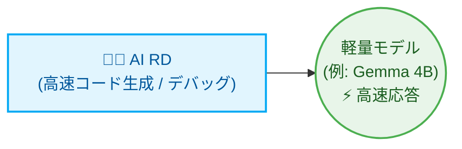

# Multi-Agent フローオーケストレーター (Orchestrator)

[繁體中文](README.md) | [English](README_en.md) | [日本語](README_ja.md) | [简体中文](README_zh-CN.md)

本プロジェクトは、Python で書かれた軽量な Multi-Agent フローオーケストレーターです。決定論的な状態機械（State Machine）を使用して、要件計画、アーキテクチャレビュー、実装、検証、コードレビュー、およびリリースノート作成を実行します。各タスクは、その複雑さとドメインリスクに基づいて、対応する役割とモデル層にルーティングされます。

---

## システムアーキテクチャ

```text
               ユーザー入力 (User Input)
                    ↓
          [ Python Orchestrator ]
                    ↓
          [ PM (要件分析・タスク割り当て) ]
                    ↓
          [ Architect (計画・アーキテクチャレビュー) ]
                    ↓
       [ RD チーム (Senior / Middle / Junior) ]
                    ↓
          [ QA チーム (Senior / Middle / Junior) ]
                    ↓
          [ Reviewer (コードレビュー) ]
           ├── 承認 (APPROVED) → ブランチをマージし Final Report を生成
           └── 差し戻し (REJECTED) → 修正タスク票 (FIX-TASK) を生成し Developer に返してピンポイント修正
                    ↓
          [ Assistant (CHANGELOG.md を自動生成) ]
```

---

## 役割の高度なカスタマイズと動的割り当て (Highly Customizable & Dynamic Role Allocation)

このオーケストレーターは、PM、Architect、RD、Reviewer、QA、および Assistant を常に有効にします。PM はプロジェクトで必要な場合にのみドメインスペシャリスト（Specialists）を選択し、その分析結果は計画承認前に Architect に提供されます。

| 役割 | 使用状況 | デフォルトのモデルルート |
| --- | --- | --- |
| PM | すべてのプロジェクト：要件定義とタスク割り当て | Codex `gpt-5.6-sol` |
| Architect | すべてのプロジェクト：計画とアーキテクチャの承認 | AGY Gemini `gemini-3.1-pro` |
| RD / QA senior | アーキテクチャ、セキュリティ、移行、または曖昧な作業 | Codex `gpt-5.6-terra` |
| RD / QA middle | 標準的な機能および統合の作業 | Codex `gpt-5.6-luna` |
| RD / QA junior | 隔離された、反復的な定常作業 | AGY Gemini `gemini-3.5-flash` |
| Reviewer | すべてのプロジェクト：コードとテスト結果のレビュー | Codex `gpt-5.6-sol` |
| Assistant | すべてのプロジェクト：CHANGELOG と定型ドキュメント作成 | Local Ollama `gemma4:latest` |

### 動的スペシャリスト (Dynamic Specialists)

PM は、トリガー条件が適用される場合にのみ、以下のスペシャリストをアクティブ化できます。

| スペシャリスト | トリガー条件 | デフォルトのモデルルート |
| --- | --- | --- |
| Sales (ビジネス) | ビジネススコープや受け入れ基準が不明確な場合 | Local Ollama `qwen2.5:latest` |
| Security (セキュリティ) | 認証、シークレット、決済、PII（個人情報）、または攻撃面が関わる場合 | Local Ollama `deepseek-r1:latest` |
| RA (規制・法務) | 法律、規制、ヘルスケア、財務コンプライアンス、またはプライバシー義務が適用される場合 | AGY Gemini `gemini-3.1-pro` |
| SRE | CI/CD、コンテナ、デプロイ、監視、または運用の信頼性がスコープ内にある場合 | AGY Gemini `gemini-3.1-pro` |

RA はモデルによるレビューを提供するものであり、検証済みの法的調査ではありません。本番環境のコンプライアンス作業では、信頼できる情報源の検索と引用を追加する必要があります。

### 🚀 最小構成 (対象: 小規模ツール、単一スクリプト、高速イテレーション)

要件が明確で範囲の小さいタスクでは、単一の役割だけを配置し、最速の成果物生成を優先できます。



### 🏢 究極の最大構成 (対象: エンタープライズ、全ライフサイクル DevSecOps)

エンタープライズレベルおよび高度なコンプライアンスが求められるソフトウェア開発では、システムを完全な仮想チームにスケールできます。

* **クロスドメインの連携とコンプライアンス**：AI Business が要件を提示し、AI PM が仕様に変換します。マージ前に、AI Security Guard（セキュリティゲートキーパー）と AI RA (Regulatory Affairs、規制レビュー担当) がコンプライアンスを確認します。
* **コア実装とデリバリー**：AI RD が実装し、AI Reviewer が品質を検査し、AI SRE が CI/CD およびデプロイスクリプトを作成します。
* **補助と高頻度タスク**：AI QA がテストケースを作成し、AI Assistant が軽量モデルを使用してドキュメント処理を行い、計算リソースを節約します。

---

## ディレクトリ構造

実行後、ツールは以下を含む `.ai-company/` フォルダを作成します。

```text
.ai-company/
├── config.json             # システム設定ファイル
├── state.json              # 状態トラッカーとタスクリスト
├── request.md              # 元の要件
├── requirements.md         # Manager が生成する詳細な要件仕様書
├── implementation_plan.md  # Developer が生成する段階的な実装計画
├── action_items.json       # 構造化された JSON タスクリスト
├── developer_output.md     # Developer のログと出力
├── reviewer_output.md      # Reviewer によるレビューコメント
├── test_results.txt        # テストコマンド実行の出力結果
└── final_report.md         # プロジェクト完了後の総括レポート

# プロジェクトルート
└── CHANGELOG.md            # Assistant が自動でリアルタイム更新する変更履歴
```

---

## クイックスタートコマンド

### 1. Environment の初期化
```bash
python3 orchestrator.py init
```

### 2. 新しいタスクの開始
```bash
python3 orchestrator.py start "Add contact search feature and write tests in search.py"
```

### 3. ステップ実行 (デバッグ推奨)
```bash
python3 orchestrator.py step
```

### 4. 終了まで全自動実行
```bash
python3 orchestrator.py run
```

### 5. 状態を確認
```bash
python3 orchestrator.py status
```

### 6. 状態のリセット
```bash
python3 orchestrator.py reset --state DEVELOPING_PLAN
```

### 7. エージェントバックエンドの変更
```bash
python3 orchestrator.py set-backend developer codex
python3 orchestrator.py set-backend reviewer agy
```

---

## Ponytail ミニマル開発原則 (Minimalist Coding)

`.ai-company/config.json` で ponytail モードを有効にします：
```json
"use_ponytail": true
```
これにより YAGNI（You Aren't Gonna Need It）が強制され、AI は過剰設計を行わずに可能な限り短いコード変更（Shortest Diff Wins）を使用するようになります。

---

## 主な機能

1. **Git Worktree による分離開発 (ゼロリスク)**：すべての AI 操作は独立したブランチおよびワークツリー（`.ai-company/worktree`）で行われます。
2. **ピンポイント修正**：QA が失敗した場合、失敗した特定のロジックのみをターゲットに修正を行います。
3. **多言語インターフェース**：`en`、`zh-TW`、`ja`、および `zh-CN` をサポートします。`config.json` の `"language"` を変更して切り替えます。
4. **CHANGELOG 自動生成**：プロジェクト完了時に Assistant が自動的に `CHANGELOG.md` を生成します。
