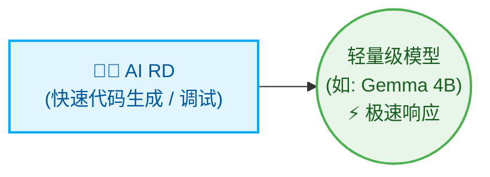
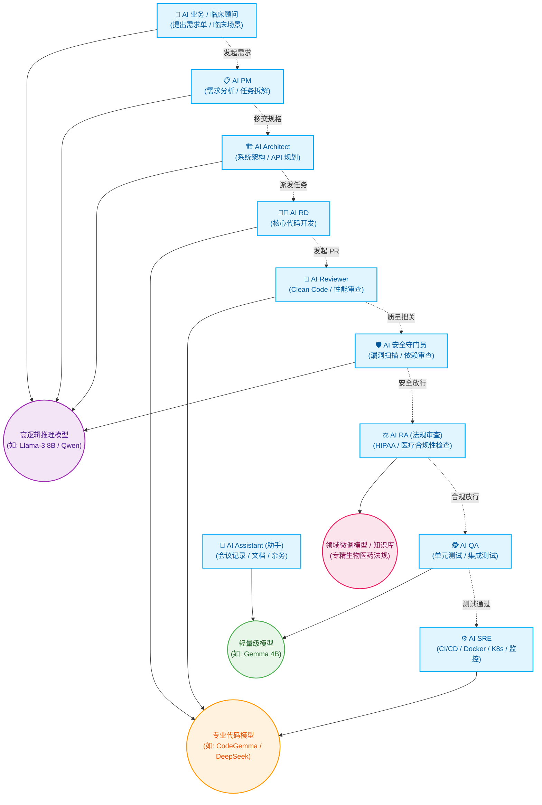

# Multi-Agent 流程协调器 (Orchestrator)

[繁体中文](README.md) | [English](README_en.md) | [日本語](README_ja.md) | [简体中文](README_zh-CN.md)

本项目是一个用 Python 编写的轻量级 Multi-Agent 流程协调器。它能够协调整合本机 Ollama 模型（Manager 与 Reviewer）、Codex CLI（Developer）与 Claude Code，以固定状态机（State Machine）的方式自动执行需求规划、代码实现、单元测试和代码审查的闭环开发流程。

---

## 系统架构

```text
               你输入需求
                   ↓
         [ Python Orchestrator ]
                   ↓
         [ Manager (负责分析需求、拆解任务) ]
                   ↓
  ┌────────────────┬────────────────┐
  │   Developer    │    Reviewer    │
  │ (负责实现任务) │ (负责代码审查) │
  └────────────────┴────────────────┘
                   ↓
         [ QA Agent 进行自动化验证 ]
                   ↓
         [ Reviewer 进行代码审查 ]
          ├── 通过 → 合并分支并生成 Final Report
          └── 退回 → 生成修复任务单 (FIX-TASK) 交回 Developer 单点修改
                   ↓
         [ Assistant (自动生成 CHANGELOG.md) ]
```

---

## 角色高度自定义与动态扩缩 (Dynamic Role Allocation)

本系统的核心设计理念在于**“角色的高度自定义与动态调整”**，能够根据项目规模（Scale）弹性配置不同的 AI 角色与底层模型，让计算资源与产出效率达到最佳化。

### 🚀 最小化配置 (适合：小型工具、单一脚本、快速迭代)

面对需求明确且范围小的任务，可以仅配置单一角色，以极速产出为主：



* **AI RD (开发者)**：唯一上阵的角色，专注将指令转换为可执行的代码。
* **分配模型**：使用轻量级模型 (如 Gemma 4B)，提供无延迟的极速生成体验。

### 🏢 终极最大化配置 (适合：生物医药产业、全生命周期 DevSecOps)

面对企业级与高度合规要求的软件开发（如生物医药产业），系统能动态扩充为一支涵盖业务、法规、开发与安全的完整虚拟团队：



* **跨域协作与合规把关 (生物医药专属亮点)**：由 AI 业务提出临床需求，AI PM 转化为工程规格；在代码合并前，不仅经过 AI 安全守门员把关，更加入 **AI RA (法规审查员)**，确保系统架构与数据处理符合生物医药法规 (如 HIPAA / 个人信息保护法)。
* **主力实现与交付 (分配给专业代码模型)**：AI RD 负责实现，AI Reviewer 检视质量，最后交由 AI SRE 编写 CI/CD 与部署脚本 (IaC)。
* **辅助与高频任务 (分配给轻量极速模型)**：AI QA 负责快速产出大量测试用例，AI Assistant 随时待命处理文档生成，最大化节省高参数量模型的计算资源。

---

## 文件目录结构

本工具执行后，会自动在当前目录下创建 `.ai-company/` 文件夹，并包含以下文件：

```text
.ai-company/
├── config.json             # 系统设置文件 (模型名称, 测试指令, 代理人后端, 语言)
├── state.json              # 状态记录文件 (记录当前执行状态与任务清单)
├── request.md              # 你的原始自然语言需求
├── requirements.md         # Manager 生成的详细功能需求说明书
├── implementation_plan.md  # Developer 生成的步骤化实现计划
├── action_items.json       # 经 Manager 拆解后的结构化 JSON 任务清单
├── developer_output.md     # 实现过程中 Developer 的日志与输出
├── reviewer_output.md      # Reviewer 针对计划与代码的审查意见
├── test_results.txt        # 测试指令执行的输出结果
└── final_report.md         # 项目完成后的总结报告

# 项目根目录
└── CHANGELOG.md            # Assistant 自动实时更新的变更日志
```

---

## 如何避免 WSL 内存不足与卡死（非常重要 ⚠️）

您的 WSL 虚拟机目前配置的物理内存为 **7.7 GB**。因为 `gemma4:latest` 的大小约为 **9.6 GB**，如果直接在 WSL 内部运行 Ollama 加载此模型，会导致 WSL 的内存严重不足、疯狂进行交换（Swapping）并使系统完全卡死。

### 建议的解决方案：使用 Windows Host 的 Ollama
1. **在 Windows 主机下载并启动 Ollama**（Windows 主机可以使用 GPU 显存和更大的系统内存）。
2. 在 WSL 中，使用 `ip route show | grep default` 查询 Windows 主机的 IP（初始化时，协调器会自动帮你计算出建议的 Windows Host IP，例如 `172.17.144.1`）。
3. 修改 `.ai-company/config.json`，将 `ollama_url` 指向 Windows 的 IP：
   ```json
   {
     "ollama_url": "http://172.17.144.1:11434",
     "ollama_model": "gemma4:latest",
     ...
   }
   ```
4. 这样一来，WSL 内的 Python Orchestrator 就会通过内部网络向 Windows 的 Ollama 发送请求，既能享用本机计算又不会占用 WSL 宝贵的 7.7GB 内存！

---

## 快速上手指令

### 1. 初始化环境
在当前 Git 项目目录下执行：
```bash
python3 orchestrator.py init
```
这会创建 `.ai-company/` 文件夹并生成默认设置文件。

### 2. 启动新任务
输入你的自然语言需求，启动开发流程：
```bash
python3 orchestrator.py start "加入联系人搜索功能，并在 search.py 写好对应测试"
```
这会将状态重设为 `PLANNING`，并将需求写入 `.ai-company/request.md`。

### 3. 单步执行（推荐用于调试或逐步审查）
每次执行下一个状态转移：
```bash
python3 orchestrator.py step
```
这会执行当前状态（例如 `PLANNING` -> `DEVELOPING_PLAN`），并在完成后暂停，方便你查看中间生成的文件（例如 `requirements.md`）。

### 4. 全自动执行到结束
自动在后台跑完所有流程（遇到 Review 退回会自动进行最多 2 轮修改，直到完成或需要人工介入）：
```bash
python3 orchestrator.py run
```

### 5. 查看当前状态
显示目前状态、设置值、修改轮数以及各项任务的完成进度：
```bash
python3 orchestrator.py status
```

### 6. 重设状态
若想重新执行某一阶段（例如重新生成实现计划）：
```bash
python3 orchestrator.py reset --state DEVELOPING_PLAN
```

### 7. 更换代理人（Agent）后端
您可以随时更换个别角色的执行后端（支持 `ollama`、`codex`、`claude`、`agy`）：
* **将实现者改为 Codex CLI (默认值)**:
  ```bash
  python3 orchestrator.py set-backend developer codex
  ```
* **将审查者 (Reviewer) 改为 agy (使用您已通过 OAuth2 登录的 Gemini)**:
  ```bash
  python3 orchestrator.py set-backend reviewer agy
  ```
* **将 QA 测试员改为 Ollama**:
  ```bash
  python3 orchestrator.py set-backend qa ollama
  ```
* **将 Assistant 改为 Ollama**:
  ```bash
  python3 orchestrator.py set-backend assistant ollama
  ```

---

## Ponytail 极简开发原则 (Minimalist Coding)

本项目支持 **Ponytail** 核心思维。当您在 [.ai-company/config.json](file:///home/oss-gp/multi-agents/.ai-company/config.json) 中启用：
```json
"use_ponytail": true
```

协调器会在与 **Developer**（实现者）和 **Reviewer**（审查者）对话时，自动在 System Prompts 中注入 `ponytail` 规则。这会强力规范 AI 代理人遵守：
* **YAGNI (You Aren't Gonna Need It)**：只做当前需要的功能，不进行任何超前部署与猜测性的架构设计。
* **极简代码梯子 (The Ladder)**：优先使用系统原生功能与标准库（stdlib），避免引入非必要依赖，缩减代码行数与变更（Shortest Diff Wins）。
* **杜绝冗余封装**：不使用单一实现的接口、不做预留的工厂模式，保持代码最简化。

---

## 核心亮点功能

### 1. Git Worktree 隔离开发 (Zero-Risk)
默认开启 `"use_worktree": true`。
协调器会在后台自动创建一个独立的 Git 分支与 Worktree (`.ai-company/worktree`) 进行开发与测试。这代表您的主分支 (`master`) 完全不会被未经 Review 的代码污染。只有在 QA 与 Reviewer 都批准 (`APPROVED`) 后，系统才会安全地自动将修改合并回主分支。

### 2. 单点精准修复任务 (Targeted Fixes)
当 QA 验证失败或 Reviewer 退件时，系统不会愚蠢地强迫 Developer 重新编写所有代码。而是会将错误报告包装成单一修复任务单 (`FIX-QA-1` 或 `FIX-REV-1`)，交回给 Developer 进行精准修改，大幅节省时间与计算资源。

### 3. 多语言支持 (Multilingual Interface)
在 `.ai-company/config.json` 中设置：
```json
"language": "zh-TW"
```
支持 `en` (英文)、`zh-TW` (繁体中文)、`ja` (日文)。所有终端日志、提示词 (Prompt) 以及输出的报告与 Changelog 都会按照您的语言偏好自动切换。

### 4. Assistant 自动生成 CHANGELOG
默认开启 `"assistant": "ollama"` (指向 `gemma2:2b` 等轻量模型)。
当项目开发顺利完成合并后，Assistant 代理人会自动分析 Manager 的总结报告与 Git Diff，并“实时”为您写下一笔专业的 Markdown 格式 `CHANGELOG.md` 变更记录。

---

## 与主流大厂开源框架 (AutoGen / CrewAI / OpenDevin) 的差异与优势

如果您熟悉微软的 AutoGen 或开源的 OpenDevin，您可能会好奇本系统的独特价值。主流框架通常是强大的“通用型工具”，但在企业级软件开发落地时常遇到痛点。本系统针对**软件开发生命周期 (SDLC)** 量身打造，具备以下决定性优势：

### 1. 拒绝发散聊天，采用“确定性状态机 (State Machine)”
* **大厂框架的痛点**：基于“对话驱动 (Chat-driven)”，Agent 之间自由对话决定下一步。在软件开发中容易陷入无限循环、偏离主题，导致 API 成本暴增且不可控。
* **本系统优势**：采用严谨的固定状态机 (`需求 -> 计划 -> 开发 -> QA -> 审查 -> 合并`)。保证了每次执行的稳定性、可预测性与极高的成功率，符合企业级流程需求。

### 2. 内置 Git Worktree 安全隔离 (Zero-Risk)
* **大厂框架的痛点**：AI 通常直接在当前项目目录修改文件，一旦 AI 发生幻觉暴走，极易改坏现有代码。
* **本系统优势**：原生内置 Git 隔离机制。所有 AI 操作都在 `.ai-company/worktree` 分支中进行，主分支 (`master`) 绝对安全。只有在 AI QA 与 Reviewer 都批准 (`APPROVED`) 后才会合并，提供企业无可取代的保护伞。

### 3. 精准修复任务单 (Targeted Fixes)，节省算力
* **大厂框架的痛点**：测试失败时，通用 Agent 常会重写整个文件，不仅浪费算力，还容易引入新 Bug。
* **本系统优势**：当 QA 验证失败时，系统会将错误包装成单一修复任务单 (`FIX-QA-1`) 交回给 Developer。AI 仅针对错误点进行小幅度精准修改，大幅提高调试效率。

### 4. 内置软件工程思维 (Ponytail 极简原则)
* **大厂框架的痛点**：容易过度设计 (Over-engineering)，写出难以维护的复杂架构。
* **本系统优势**：强制注入 YAGNI 原则，禁止猜测性架构设计，追求变更最小化 (Shortest Diff Wins)。产出的代码干净、易维护且符合人类审查习惯。

---

## 集成使用 agy CLI (Gemini OAuth 2.0)

本项目原生支持直接调用您在系统中已登录的 `agy` (Antigravity CLI)，**严格禁止使用明文 API Key**，全面落实 OAuth 2.0 安全规范。

1. **认证说明**：
   只要您已经登录您的 Google 帐户，协调器在执行时就会自动调用 `agy --print` 命令取得模型响应。完全不需要填写或暴露任何 API 密钥，保证极致安全。

2. **切换角色后端为 Gemini (agy)**：
   ```bash
   python3 orchestrator.py set-backend developer agy
   ```

---

## 后端代理人容错机制 (Graceful Fallback)

为了确保在某个后端 API 或 CLI 无法运作时流程不中断：
* 如果 `claude`、`codex` 或 `gemini` 尚未登录或设置 API Key 报错，系统会自动降级（Fallback）使用本机的 **Ollama (gemma4)** 进行对应动作。
* 当您日后配置完成后，协调器会自动恢复使用您指定的高级 API/CLI。
