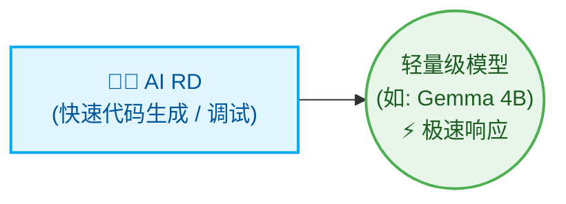

# Multi-Agent 流程协调器 (Orchestrator)

[繁體中文](README.md) | [English](README_en.md) | [日本語](README_ja.md) | [简体中文](README_zh-CN.md)

本项目是一个用 Python 编写的轻量级 Multi-Agent 流程协调器。它使用确定性状态机（State Machine）进行需求规划、架构审查、代码实现、验证、代码审查和发布说明。每个任务都会根据其复杂度和领域风险路由到相应的角色和模型层级。

---

## 系统架构

```text
               你输入需求 (User Input)
                    ↓
           [ Python Orchestrator ]
                    ↓
           [ PM (负责分析需求、拆解任务) ]
                    ↓
           [ Architect (负责计划与架构审查) ]
                    ↓
        [ RD 团队 (Senior / Middle / Junior) ]
                    ↓
           [ QA 团队 (Senior / Middle / Junior) ]
                    ↓
           [ Reviewer (负责代码审查) ]
            ├── APPROVED → 合并分支并生成 Final Report
            └── REJECTED → 生成修复任务单 (FIX-TASK) 交回 Developer 单点修改
                     ↓
           [ Assistant (自动生成 CHANGELOG.md) ]
```

---

## 角色高度自定义与动态分配 (Highly Customizable & Dynamic Role Allocation)

此协调器一律启用 PM、Architect、RD、Reviewer、QA 和 Assistant。PM 只有在项目需要时才会选择领域专家（Specialists），然后他们的分析结果会在计划批准前提供给 Architect。

| 角色 | 使用时机 | 默认模型路由 |
| --- | --- | --- |
| PM | 每个项目：需求与任务分配 | Codex `gpt-5.6-sol` |
| Architect | 每个项目：计划与架构审查 | AGY Gemini `gemini-3.1-pro` |
| RD / QA senior | 架构、安全、迁移或模糊的工作 | Codex `gpt-5.6-terra` |
| RD / QA middle | 标准功能与集成工作 | Codex `gpt-5.6-luna` |
| RD / QA junior | 孤立、重复的常规工作 | AGY Gemini `gemini-3.5-flash` |
| Reviewer | 每个项目：代码与测试结果审查 | Codex `gpt-5.6-sol` |
| Assistant | 每个项目：CHANGELOG 与常规文档 | Local Ollama `gemma4:latest` |

### 动态专家 (Dynamic Specialists)

PM 仅在适用其触发条件时启用以下专家：

| 专家 | 触发条件 | 默认模型路由 |
| --- | --- | --- |
| Sales (业务) | 业务范围或验收标准不明确 | Local Ollama `qwen2.5:latest` |
| Security (安全) | 涉及身份验证、密钥、支付、PII（个人识别信息）或攻击面 | Local Ollama `deepseek-r1:latest` |
| RA (法规) | 适用法律、法规、医疗保健、财务合规或隐私义务 | AGY Gemini `gemini-3.1-pro` |
| SRE | CI/CD、容器、部署、监控或运维可靠性在范围内 | AGY Gemini `gemini-3.1-pro` |

RA 提供的是模型审查，而非经证实的法律研究。生产环境的合规工作应增加权威来源的检索与引用。

### 🚀 最小化配置 (适合：小型工具、单一脚本、快速迭代)

面对明确且范围小的任务，可以仅配置单一角色，以极速产出为主：



### 🏢 终极最大化配置 (适合：企业级、全生命周期 DevSecOps)

对于企业级和高度合规要求的软件开发，系统能扩充为一支完整的虚拟团队：

* **跨领域协作与合规把关**：AI Business 提出需求，AI PM 转化为工程规格。在合并前，由 AI Security Guard（安全守门员） and AI RA (Regulatory Affairs，法规审查员) 检查合规性。
* **核心实现与交付**：AI RD 负责实现，AI Reviewer 检视质量，最后交由 AI SRE 编写 CI/CD 与部署脚本。
* **辅助与高频任务**：AI QA 负责编写测试用例，AI Assistant 使用轻量模型处理文档生成，以节省计算资源。

---

## 文件目录结构

本工具执行后，会自动在当前目录下创建 `.ai-company/` 文件夹，并包含以下文件：

```text
.ai-company/
├── config.json             # 系统配置文件
├── state.json              # 状态记录与任务清单
├── request.md              # 您的原始需求
├── requirements.md         # Manager 生成的详细功能需求说明书
├── implementation_plan.md  # Developer 生成的步骤化实现计划
├── action_items.json       # 结构化 JSON 任务清单
├── developer_output.md     # Developer 的日志与输出
├── reviewer_output.md      # Reviewer 的审查意见
├── test_results.txt        # 测试指令执行的输出结果
└── final_report.md         # 项目完成后的总结报告

# 项目根目录
└── CHANGELOG.md            # Assistant 自动实时更新的变更日志
```

---

## 快速上手指令

### 1. 初始化环境
```bash
python3 orchestrator.py init
```

### 2. 启动新任务
```bash
python3 orchestrator.py start "Add contact search feature and write tests in search.py"
```

### 3. 单步执行 (推荐用于调试)
```bash
python3 orchestrator.py step
```

### 4. 全自动执行到结束
```bash
python3 orchestrator.py run
```

### 5. 查看当前状态
```bash
python3 orchestrator.py status
```

### 6. 重置状态
```bash
python3 orchestrator.py reset --state DEVELOPING_PLAN
```

### 7. 更换代理人 (Agent) 后端
```bash
python3 orchestrator.py set-backend developer codex
```

---

## Ponytail 极简开发原则 (极简代码)

在 `.ai-company/config.json` 中启用 ponytail 模式：
```json
"use_ponytail": true
```
这会强制执行 YAGNI (You Aren't Gonna Need It)，并推动 AI 在不进行过度设计的情况下使用尽可能短的代码变更（Shortest Diff Wins）。

---

## 核心亮点功能

1. **Git Worktree 隔离开发 (零风险)**：所有 AI 操作都在独立的分支与工作区中进行 (`.ai-company/worktree`)。
2. **单点精准修复**：当 QA 验证失败时，仅针对具体失败的逻辑进行修复。
3. **多语言支持**：支持 `en`、`zh-TW`、`ja` 和 `zh-CN`。可在 `config.json` 中修改 `"language"` 设置。
4. **自动生成 CHANGELOG**：Assistant 代理人在项目完成后会自动生成 `CHANGELOG.md`。