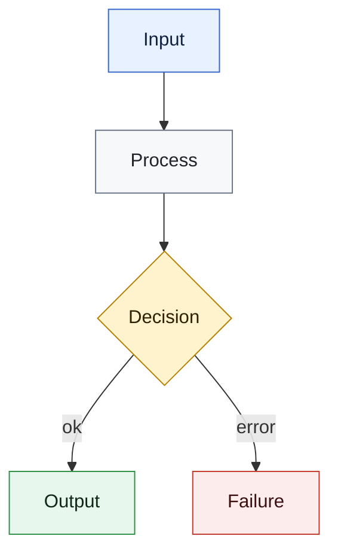

# Code Flowchart

## Purpose

Turn a scoped code investigation into a concise, readable Mermaid flowchart. Prefer a useful review diagram over a complete call graph.

## Workflow

1. Define the scope:
   - Accept a file path, folder path, whole-codebase request, or named feature.
   - If the scope is ambiguous, ask one concise clarification before drawing.
   - For a named feature, prefer `codebase-memory-mcp` to find likely entrypoints, handlers, commands, classes, tests, and output artifacts.
   - If the project is not indexed, run `index_repository` first.

2. Inspect before drawing:
   - Read only the files needed to understand the requested flow.
   - Prefer `search_graph` or `search_code` for discovery, then `get_code_snippet` for precise symbol inspection.
   - Trace entrypoint, main functions/classes, important decisions, data inputs, outputs, errors, and external tools/services.
   - Do not invent behavior that is not visible in the code. Mark uncertain links as inferred only when the code strongly supports them.
   - If `codebase-memory-mcp` is unavailable, read the necessary files directly and keep the scope tight.

3. Choose diagram granularity:
   - For one file, draw the main execution and data flow.
   - For one folder, draw module-level flow first, then add key subflows only if they improve clarity.
   - For a whole codebase, draw a high-level architecture/process flow. Do not put every function in one diagram.
   - For a feature, draw the user/request path from trigger to output, including validation and failure paths.

4. Produce Mermaid:
   - Default to one Markdown response containing a `mermaid` code block.
   - Use `flowchart TD` unless the user requests another direction.
   - Keep the diagram visually clean: aim for 6-12 nodes in a top-level diagram; split into smaller diagrams if more detail is needed.
   - Use short node labels suitable for manager/RD review. Prefer 1-4 words per node.
   - Put the happy path in the center/top-to-bottom path, and branch errors or edge cases off to the side.
   - Avoid hairballs: no dense call graphs, no every-function diagrams, and no more than three outgoing arrows from one node unless it is a clear router.
   - Use `subgraph` blocks to group files, modules, services, phases, or layers when the scope is larger than one file.
   - Use class styles for stable visual meaning:
     - input: source files, CLI args, user request, config
     - process: functions, methods, transformations
     - decision: branches, validation, gates
     - output: reports, files, returned values
     - error: exceptions, failed validation, blocked paths
     - external: tools, services, dependencies
   - Keep Mermaid syntax simple enough to render in GitHub/GitLab/Obsidian without extra tooling.

5. Writing files:
   - Do not write a file unless the user asks for a path or explicitly asks to save the diagram.
   - If writing a file, prefer one Markdown file with a Mermaid code block.
   - Do not install `mermaid-cli` or generate PNG/SVG unless the user explicitly requests rendered image output and approves the tooling.

## Mermaid Style Template

Use this style block unless the local doc already has a stronger convention:

## Output

Report:

- scope analyzed
- files read
- assumptions or inferred links, if any
- Mermaid diagram
- suggested split into smaller diagrams when the scope is too large
