# Workflow State Machine

```mermaid
stateDiagram-v2
    [*] --> PLANNING
    PLANNING --> DEVELOPING_PLAN
    DEVELOPING_PLAN --> REVIEWING_PLAN

    REVIEWING_PLAN --> IMPLEMENTING: PLAN_STATUS: APPROVED
    REVIEWING_PLAN --> DEVELOPING_PLAN: rejected; retries remain
    REVIEWING_PLAN --> WAITING_FOR_OWNER: rejected; retries exhausted

    IMPLEMENTING --> TESTING
    TESTING --> REVIEWING_CODE: QA_STATUS: PASSED
    TESTING --> IMPLEMENTING: QA_STATUS: FAILED
    REVIEWING_CODE --> COMPLETED: approved
    REVIEWING_CODE --> IMPLEMENTING: revise
    REVIEWING_CODE --> WAITING_FOR_OWNER: rejected; retries exhausted

    WAITING_FOR_OWNER --> IMPLEMENTING: plan approved / code review passed
    WAITING_FOR_OWNER --> DEVELOPING_PLAN: plan revised
    WAITING_FOR_OWNER --> IMPLEMENTING: code revised
    WAITING_FOR_OWNER --> FAILED: rejected
```

Rules:

- The shared model router only calls models and selects fallbacks.
- Only IMPLEMENTING requires file-marker blocks.
- Manager tasks must modify project files; planning and inspection are not implementation tasks.
- A rejected plan never enters IMPLEMENTING automatically.
